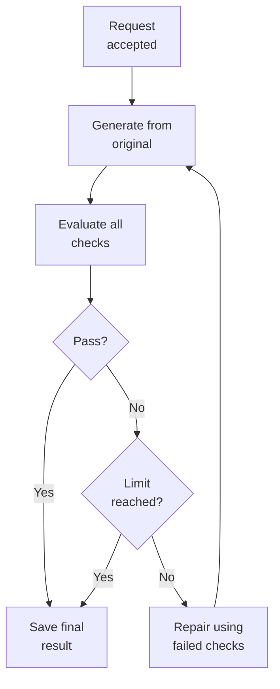

# Design

## Goal

- Containerised asynchronous backend for visual recommendations.
- Generate one edited variant per creative from recommendations and brand rules.
- Return a structured visual evaluation through a polling API.
- Use Swagger UI as the interactive submission interface; no custom frontend.

## Workflow

## Boundaries and trust

- **FastAPI:** multipart parsing, safe errors, task polling, and artifact delivery.
- **Workflow:** timeouts, concurrency, iteration bounds, and task outcomes.
- **OpenAI adapter:** prompts, provider payloads, and provider-response decoding.
- **Pydantic:** uploads, configuration, and evaluator-output validation.

Safety rules:

- Treat inputs, filenames, configuration, and provider output as untrusted.
- Decode uploaded and generated images before use.
- Use UUID task directories and server-generated image IDs for filesystem access.
- Do not expose or log secrets, image bytes, full prompts, or provider payloads.
- Require evaluator coverage to match the original recommendations and criteria.

## Scope boundaries

Not included: durable jobs, restart recovery, horizontal scaling, authentication,
multi-tenancy, database/object storage, distributed queues, automatic retries,
or a custom frontend.

Those additions should follow real product, scale, data-governance, and
reliability requirements—not be speculative complexity in this MVP.
