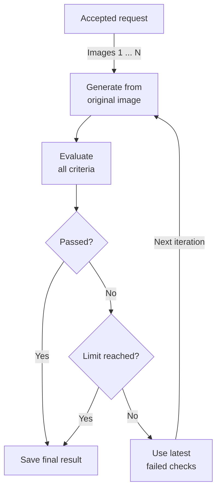

# Visual Recommendations - Minimal Viable Solution Design

## Goal

Build a minimal viable, maintainable, containerised asynchronous FastAPI service
that meets the requirements:

- Accept one to ten marketing creatives per request, textual recommendations,
  and brand guidelines.
- Generate an edited visual variant for each creative.
- Evaluate whether every recommendation was applied.
- Evaluate whether the variant complies with the brand guidelines.
- Expose the workflow through Swagger UI without building a separate frontend.

The implementation should demonstrate a clear agentic workflow and apply
proportionate software-engineering best practices: explicit ownership, validated
boundaries and configuration, dependency injection at external seams, and
deterministic tests. These practices must not introduce production infrastructure
or speculative abstraction that the assignment does not require.

## Core design

The application has two AI roles implemented as ordinary Python functions behind
one small OpenAI adapter:

1. **Image editor** - creates one variant from the original creative, all of its
   recommendations, and its brand guidelines.
2. **Visual evaluator** - compares the original and generated images and returns
   a structured decision for every recommendation and brand criterion.

If a variant fails evaluation, the editor uses the evaluator's feedback to
repair it until evaluation passes or the configured iteration limit is reached.
One iteration means one image-editing call followed by one evaluation call;
the initial generation counts as iteration 1. The limit applies independently
to each creative and is configurable from 1 to 5, with a hard ceiling of five
iterations enforced in code to bound cost.

This bounded feedback loop is the agentic part of the workflow. It does not
require an agent framework, planner, tool-calling loop, or general-purpose state
machine.

## Engineering baseline

The MVP keeps a few conventional quality boundaries because they make the code
easier to review and change without expanding the product scope:

- `create_app` is the composition root. It constructs application-owned state
  and accepts configuration and the OpenAI adapter as dependencies, which keeps
  tests isolated without a dependency-injection framework.
- The `config` package is the only place that reads the selected TOML document,
  the local secret file, or environment variables. Settings are typed,
  validated once at startup, and then passed explicitly.
- Dependencies point inward: FastAPI handlers call the workflow, the workflow
  uses validated models and the narrow image-service contract, and provider
  request details stay in the OpenAI adapter. The workflow does not import or
  return FastAPI types.
- Long-lived provider clients are created once per application and closed by
  the FastAPI lifespan. A client is not constructed for every model call.
- `pyproject.toml` is the single home for dependency and tool configuration;
  `uv.lock` is committed for reproducible installs.
- Formatting, linting, static type checking, and deterministic tests form the
  automated quality gate.

Packages make the main concerns visible when skimming the repository: API
routing, configuration, schema-backed models, workflow orchestration, and AI
service adapters. Each package keeps a small public interface and avoids
additional internal layers until its responsibilities provide a concrete reason
to split further.

## API

FastAPI exposes the interactive Swagger UI at `/docs` and its generated OpenAPI
schema at `/openapi.json`. Swagger UI is the demo interface for submitting the
multipart request and inspecting the polling endpoints.

All task endpoints are versioned under `/api/v1`. The operational health check
is deliberately unversioned because it reports whether this service process is
running rather than exposing a product API contract.

### `POST /api/v1/tasks`

Starts an asynchronous visual-recommendation task.

The request uses `multipart/form-data` so it can be submitted directly through
Swagger UI. Every upload field is described as a binary file in OpenAPI, so the
interactive form presents system file pickers rather than text inputs.

| Field | Type | Description |
| --- | --- | --- |
| `images` | One to ten PNG/JPEG files | The supplied marketing creatives. |
| `recommendations` | JSON file | Recommendations grouped by image filename. |
| `brand_guidelines` | JSON file | Brand guidelines grouped by image filename. |

The JSON structures match the supplied assignment files. Filenames join each
uploaded image to its recommendations and guidelines.

Successful response: `202 Accepted`

```json
{
  "task_id": "3e866993-5c55-4db5-a2f9-542c442018e9",
  "status": "pending",
  "status_url": "/api/v1/tasks/3e866993-5c55-4db5-a2f9-542c442018e9"
}
```

### `GET /api/v1/tasks/{task_id}`

Returns the current task state. The possible states are `pending`, `running`,
`completed`, and `failed`.

A completed response contains one result per input image. `attempts` reports the
actual number of iterations performed for that image, from 1 to the configured
limit (never more than 5). `variant_url` and `evaluation` refer to its final
iteration. Reaching the limit with `overall_pass: false` still produces a
`completed` task; only technical execution errors produce `failed`.

```json
{
  "task_id": "3e866993-5c55-4db5-a2f9-542c442018e9",
  "status": "completed",
  "results": [
    {
      "image_id": "image_1",
      "source_filename": "creative_1.png",
      "variant_url": "/api/v1/tasks/3e866993-5c55-4db5-a2f9-542c442018e9/variants/image_1",
      "attempts": 1,
      "evaluation": {
        "recommendations": [
          {
            "id": "rec_1",
            "applied": true,
            "reason": "The headline has stronger contrast."
          }
        ],
        "brand_checks": [
          {
            "criterion": "Do not modify or remove the brand logo",
            "compliant": true,
            "reason": "The logo remains visible in its original position."
          }
        ],
        "overall_pass": true
      }
    }
  ],
  "error": null
}
```

### `GET /api/v1/tasks/{task_id}/variants/{image_id}`

Returns the generated image file. `image_id` is a server-owned identifier and is
resolved only within the corresponding task directory.

### `GET /health`

Returns `{"status": "ok"}` when the process is running.

## Demo API

The demo router mirrors the task lifecycle under `/api/v1/demo` while using the
committed files in `examples/demo/` as defaults:

- `POST /api/v1/demo/tasks`
- `GET /api/v1/demo/tasks/{task_id}`
- `GET /api/v1/demo/tasks/{task_id}/variants/{image_id}`

The POST request remains `multipart/form-data`, but its image,
recommendations, and brand-guideline uploads are optional. Omitting a field
uses the corresponding committed demo file or files. Supplying that field
replaces the default, so the Swagger form remains manually editable. Demo tasks
use the same validation, workflow, in-memory state, and artifact storage as the
versioned product API, including the limit of ten images per request. The demo
router adds no alternate processing behavior.

## Asynchronous execution and parallelism

The HTTP request must not wait for image generation. `POST /api/v1/tasks`
records an in-memory task, schedules the workflow as a FastAPI background task,
and returns `202 Accepted` with a task ID immediately. Image processing continues
after the response; the client polls `GET /api/v1/tasks/{task_id}` for results.

Each task contains one to ten independent image pipelines, with at most two
pipelines processing concurrently per task. Additional images wait for a free
pipeline slot. Work within one image pipeline stays sequential because each
step depends on the preceding output.

The diagram shows image processing after the request is accepted. The same flow
runs for images 1 through `N` (at most ten), with two images active at a time.
Each image starts at iteration 1 and has its own evaluation feedback. The
iteration limit includes the initial generation and can never exceed five.



Each evaluation is validated before either decision. A failed evaluation with
iterations remaining feeds back into image generation, which uses the original
image and the latest failed checks. Both exit paths save the last image and its
evaluation, including a failing evaluation when the limit is reached.

The workflow uses `asyncio.gather` for all uploaded images and a semaphore of
two held for each image's complete pipeline, including its repair iterations.
When a pipeline finishes, a waiting image can start. The task completes after
all image pipelines finish and contains one result per uploaded image. This
concurrency is deliberately bounded because image generation is the slowest
and most rate-limit-sensitive operation.

Recommendation checks are not parallelised into separate model calls. The
evaluator receives the original image, generated image, complete recommendation
list, and complete brand-guideline object in one request. It returns one
structured result containing all checks. This choice:

- Reduces API calls, latency, and cost.
- Gives every check the same visual and brand context.
- Avoids conflicting judgments from separate evaluator calls.
- Keeps the evaluation schema and error handling small.

For the supplied two-image, three-recommendation example, a task that passes on
both first attempts uses two image-editing calls and two evaluation calls.
Each additional iteration adds one image-editing call and one evaluation call
for that image. With a configured iteration limit of `K`, each creative uses at
most `K` editing calls and `K` evaluation calls. A task with `N` images uses at
most `N × K` calls of each kind. At the hard ceiling of five iterations, a
ten-image task uses at most 50 editing calls and 50 evaluation calls in total.
This bounds calls per task, not a monetary amount or spending across tasks.

## Workflow

For each image:

1. Load the original image, its recommendations, and its brand guidelines.
2. Build a direct editing prompt that makes the brand guidelines authoritative.
3. Ask the image model to edit the original creative and save the returned
   image under the task directory.
4. Ask the evaluator to compare the original and variant.
5. Validate the evaluator's structured response with Pydantic.
6. Stop immediately if `overall_pass` is true or the iteration limit is reached.
7. Otherwise, increment the iteration count and repeat steps 3–6, adding the
   failed checks from the latest validated evaluation to the editing prompt.
8. Store the final variant, its evaluation, and the actual iteration count as
   `attempts` in the in-memory task record, whether that evaluation passes or
   fails.

Every initial generation and repair starts from the original image. This avoids
cumulative visual drift. Each repair retains all original recommendations and
brand guidelines and uses only the latest evaluation as repair feedback. Every
iteration evaluates all criteria again, including those that passed previously.
The workflow returns the last evaluated variant without ranking attempts or
exposing an attempt history.

A technical failure during any iteration stops that image pipeline and fails
the task with a safe error. Repairs follow failed visual evaluations; they are
not retries for provider errors, timeouts, or invalid evaluator output.

## Data models

Only models used at an external or AI boundary are defined.

```text
Recommendation
  id: str
  title: str
  description: str
  type: str

BrandGuidelines
  protected_regions: list[str]
  typography: str
  aspect_ratio: str
  brand_elements: str

RecommendationCheck
  id: str
  applied: bool
  reason: str

BrandCheck
  criterion: str
  compliant: bool
  reason: str

Evaluation
  recommendations: list[RecommendationCheck]
  brand_checks: list[BrandCheck]
  overall_pass: bool
```

The evaluator must return one `RecommendationCheck` for every supplied
recommendation and one `BrandCheck` for every explicit brand criterion.
Application control flow never depends on unvalidated model prose.

## OpenAI integration

One `OpenAIService` owns both provider calls:

- Image editing uses the OpenAI image-editing API with a configurable image
  model.
- Evaluation uses the Responses API with a vision-capable model and a strict
  JSON Schema response matching `Evaluation`.

The application uses the asynchronous OpenAI client so active image pipelines
can overlap network waits. Tests inject a deterministic fake service and never
make real API calls.

Non-secret runtime configuration uses one complete TOML document per deployed
environment. The repository includes `config/dev.toml` and `config/test.toml`;
the application loads exactly the path supplied through `APP_CONFIG_FILE` and
does not merge files or branch on an environment name:

```toml
[providers]
image_editor_model = "gpt-image-2"
evaluator_model = "gpt-5.6-terra"
timeout_seconds = 120

[limits]
max_image_size_mb = 10
max_iterations = 2

[logging]
level = "INFO"

[storage]
artifact_root = "runtime/tasks"
```

The only secret setting is `OPENAI_API_KEY`. `.env.example` documents that name
with a safe placeholder, while the real value belongs in the ignored local
`.env` file or the process/container environment. A process environment value
takes precedence over `.env`. `APP_CONFIG_FILE` is required from the shell or
deployment platform and selects one complete non-secret configuration file. It
is not read from `.env`, which remains secret-only. Other non-secret environment
values are ignored so individual settings still have one clear source.

The configuration package contains only the loader and the immutable, typed
`AppConfig` schema and checker; it defines no adjustable runtime defaults. The
selected TOML document is the single source of non-secret setting values.
Loading fails fast with a concise error when no file is selected, or when the
selected file is missing, malformed, incomplete, or contains unknown settings.
Tests can construct `AppConfig` directly or pass explicit file paths without
mutating process-wide environment state.

`limits.max_iterations` is a required TOML integer from 1 through 5, mapped to
`AppConfig.max_iterations`. Both committed configuration files should set it to
`2` initially, preserving the existing maximum of one initial generation plus
one repair. A value of `1` disables repairs; `5` permits up to four repairs.
Missing values, booleans, strings, fractional values, and integers outside the
range fail startup with a safe configuration error rather than being coerced or
silently clamped.

The immutable setting is passed explicitly from `create_app` through task
scheduling to the workflow. Product and demo tasks use the same setting; there
is no per-request override. Configuration changes take effect after restart.

The maximum allowed value is a code constant, `MAX_ITERATIONS = 5`, not another
configuration setting. Both configuration validation and the workflow use this
ceiling. The workflow also bounds its loop by
`min(max_iterations, MAX_ITERATIONS)` so a value above five cannot cause a sixth
iteration even if startup validation is bypassed by a direct internal call.
Direct workflow calls with a non-integer or non-positive limit fail before any
provider call.

Only values that are genuinely adjustable are exposed. The ten-image limit,
two-pipeline concurrency bound, and five-iteration ceiling remain fixed code
invariants.

## Storage and task state

Task state is a process-local dictionary keyed by a UUID. Input images, the
validated JSON input documents, and generated images are stored under:

```text
runtime/tasks/<task_id>/
  inputs/
    image_1.png
    recommendations.json
    brand_guidelines.json
  variants/
```

All directory and file names are generated or resolved by the server. Uploaded
filenames are metadata and are never used directly as filesystem paths.

Each application startup clears the configured task-artifact directory and the
adjacent server-managed log directory before accepting requests. Runtime files
therefore belong only to the current process run.

This MVP runs as one application process. The consequences of process-local
state and storage are recorded explicitly under **Accepted limitations** rather
than addressed with infrastructure outside the assignment scope.

## Validation and errors

Validation is intentionally limited to inexpensive system-boundary checks:

- Accept one to ten images; reject zero images or more than ten with `422`.
- Limit upload size.
- Decode each image and accept only PNG or JPEG.
- Parse both JSON files with Pydantic.
- Require recommendations and guidelines for every uploaded filename.
- Reject filenames in the JSON that do not correspond to an uploaded image.

FastAPI/Pydantic validation errors return `422`. An OpenAI or unexpected
workflow exception marks the task as `failed` with a short safe message. The
service does not add retries, exception taxonomies, or partial-success rules.
The known image/JSON filename-set mismatch also returns the stable code
`image_json_filename_set_mismatch` so clients can correct partial demo
overrides without parsing prose.

## Logging

Use Python's standard `logging` module and write to stdout plus a
server-managed `logs/app.log` file beside the configured artifact-root
directory (for example, `runtime/logs/app.log`). The file includes application
events and Uvicorn operational/access records. Log only safe, operational
metadata:

- UTC timestamp.
- Request method, route template, validation-rejection category, count, error
  types, recognized multipart field names, and vetted reason codes, without
  invalid values or multipart content.
- Task ID and image identifier (`all` for task-wide events).
- Workflow step, attempt number, and task image count where relevant.
- Started, succeeded, or failed outcome.
- Step, pipeline, and task duration.
- Final evaluation pass/fail and exception class names, without exception text.
- Provider operation, HTTP status, provider error code, and request ID, without
  provider response content.

Do not log API keys, image bytes, filenames, complete prompts, uploaded JSON
payloads, provider payloads, exception messages, or tracebacks.

## Code structure

```text
src/app/
  api/
    __init__.py       Public router exports
    routes.py         Unversioned operational routes
    task_operations.py Shared upload validation, task creation, and retrieval
    v1/
      __init__.py     Public v1 router export
      routes.py       Versioned task endpoints and request validation
      demo/
        __init__.py   Public v1 demo router export
        routes.py     Default-backed v1 demo task endpoints
  config/
    __init__.py       Public configuration exports
    load_config.py    TOML selection plus secret loading
    validate_config.py Typed settings schema and safe validation
  schema_models/
    __init__.py       Public schema-model exports
    inputs.py         Recommendation and brand-guideline input schemas
    evaluations.py    Structured evaluator-output schemas
    tasks.py          Task state and task-response schemas
    misc.py           Small operational schemas, including health
  workflows/
    __init__.py       Public workflow exports
    visual_recommendations.py Image orchestration and bounded iteration loop
  ai_services/
    __init__.py       Public AI-service exports
    openai.py          OpenAI image-editing and evaluation adapter
  main.py             Composition root and in-memory task registry
tests/
  test_api.py
  test_demo.py
  test_workflow.py
config/
  dev.toml           Complete non-secret dev settings
  test.toml          Complete non-secret test-deployment settings
examples/demo/       Supplied creatives and JSON demo inputs
Dockerfile
pyproject.toml
README.md
DESIGN.md
.github/workflows/ci.yml
```

These small application concerns are enough. Additional repositories, domain
layers, dependency-injection frameworks, and generalized provider abstractions
are excluded. Package `__init__.py` files expose only the models, workflows,
adapters, routers, or settings used by callers; callers do not depend on
internal file layout.

## Tests

The default test suite uses a fake OpenAI service and covers:

1. Valid uploads of 1, 2, and 10 images return `202` and later complete with one
   retrievable result per image. Product and demo uploads reject more than ten
   images; product uploads also reject zero images. Omitted demo images use the
   committed defaults.
2. A ten-image task processes all images with no more than two pipelines active
   at once. Two pipelines can overlap, waiting images start as slots become
   free, and repair iterations retain their pipeline's slot.
3. One evaluator call receives all recommendations for its image.
4. Limits of 1, 2, 3, 4, and 5 bound the number of generation/evaluation pairs
   independently per image, including the initial attempt. A passing evaluation
   stops immediately, even when further iterations are available.
5. Repeated failures stop exactly at the configured limit, return the last
   variant and evaluation with the correct `attempts`, and leave the task
   `completed` with `overall_pass: false`.
6. Every repair uses the original creative, all recommendations and guidelines,
   and the latest validated evaluation; each evaluation checks all criteria.
7. Configuration rejects missing or invalid iteration limits, including values
   outside 1–5 and non-integers. A direct workflow call above the ceiling never
   makes a sixth generation or evaluation call; invalid non-integer or
   non-positive workflow limits make no provider calls.
8. Product and demo task scheduling both pass the configured iteration limit
   through to the workflow.
9. Invalid JSON or an invalid image is rejected.
10. A provider exception, timeout, or invalid evaluator output at any iteration
    marks the task as failed without further repairs or exposing secrets.

One optional, explicitly enabled smoke test may call the real OpenAI API with a
single supplied creative.

Ruff provides formatting and linting, mypy checks the typed application code,
and pytest verifies behavior. These tools are configured in `pyproject.toml` and
run in one small CI workflow. The real-API smoke test is excluded from CI.

## Container

The Dockerfile uses a small pinned Python base image, installs from the lockfile,
copies only required application files, creates a writable runtime directory,
and runs as a non-root user. It starts one Uvicorn worker because task state is
stored in memory. `.dockerignore` keeps local environments, caches, runtime
artifacts, and secrets out of the build context.

Docker Compose, Redis, PostgreSQL, a separate worker container, and cloud object
storage are not required.

## Explicit non-goals

- A custom frontend.
- Durable jobs or restart recovery.
- Authentication, users, or multi-tenancy.
- A distributed task queue.
- A planning agent.
- Multiple candidates per iteration, attempt-history APIs, or selection of the
  best among generated attempts.
- Parallel evaluator calls per recommendation.
- Automatic provider retries or exponential backoff.
- Pixel-perfect proof that logos, faces, products, or typography are unchanged.
- Production deployment infrastructure, metrics, or tracing.

## Accepted limitations

These are deliberate tradeoffs for the interview MVP and should be stated in
the README and technical discussion:

- Task state is process-local. A restart loses task status and interrupts
  pending or running work; tasks are not resumed.
- The service runs one process with one worker. It does not support horizontal
  scaling or coordinate work across instances.
- Inputs and variants use local disk. Artifacts are not durable, and startup
  clears prior task directories and runtime logs.
- A technical failure in any image pipeline fails the whole task. There is
  no partial-success response or automatic provider retry.
- Image generation and visual evaluation are probabilistic. A passing brand
  evaluation is a model judgment, not pixel-perfect proof of compliance.
- Each request is limited to ten creatives and at most five iterations per
  creative, including the initial generation. The service returns the last
  evaluated variant; more iterations do not guarantee a passing result.
- There is no authentication or tenant isolation, so this service is intended
  for a controlled demo environment rather than public deployment.
- Swagger UI is the only user interface, and clients must poll for completion.

## Acceptance criteria

The MVP is complete when:

- It builds and runs in Docker.
- Swagger UI accepts the two supplied creatives and two supplied JSON files.
- Product and demo requests support up to ten images with matching JSON inputs,
  and reject requests exceeding that limit.
- Submission returns `202` without waiting for model work.
- Image pipelines run with a maximum concurrency of two per task, and all
  accepted images are processed.
- Each creative produces a retrievable variant and structured evaluation.
- Every recommendation and brand criterion appears in the evaluation result.
- The TOML iteration limit accepts integers from 1 through 5 and is applied to
  both product and demo tasks. Each image stops when evaluation passes or its
  limit is reached; code prevents more than five iterations per image.
- Final responses report the actual iteration count and the last evaluated
  variant, with `completed` used even when the iteration limit is exhausted
  without passing evaluation.
- Automated tests pass without network access or an API key.
- Formatting, linting, and static type checks pass locally and in CI.
- The container runs as a non-root user with dependencies installed from the
  committed lockfile.
