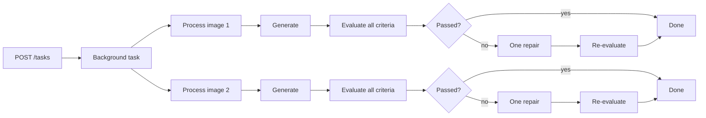

# Visual Recommendations - Minimal MVP Design

## Goal

Build the smallest containerised, asynchronous FastAPI service that meets the requirements:

- Accept marketing creatives, textual recommendations, and brand guidelines.
- Generate an edited visual variant for each creative.
- Evaluate whether every recommendation was applied.
- Evaluate whether the variant complies with the brand guidelines.
- Expose the workflow through Swagger UI without building a separate frontend.

The implementation should demonstrate a clear agentic workflow and sound
software-engineering choices without introducing production infrastructure that
the assignment does not require.

## Core design

The application has two AI roles implemented as ordinary Python functions behind
one small OpenAI adapter:

1. **Image editor** - creates one variant from the original creative, all of its
   recommendations, and its brand guidelines.
2. **Visual evaluator** - compares the original and generated images and returns
   a structured decision for every recommendation and brand criterion.

If the first variant fails evaluation, the editor may make exactly one repair
attempt using the evaluator's feedback. This bounded feedback loop is the
agentic part of the workflow. It does not require an agent framework, planner,
tool-calling loop, or general-purpose state machine.

## API

FastAPI generates the OpenAPI schema and Swagger UI at `/docs`.

### `POST /tasks`

Starts an asynchronous visual-recommendation task.

The request uses `multipart/form-data` so it can be submitted directly through
Swagger UI.

| Field | Type | Description |
| --- | --- | --- |
| `images` | One or two PNG/JPEG files | The supplied marketing creatives. |
| `recommendations` | JSON file | Recommendations grouped by image filename. |
| `brand_guidelines` | JSON file | Brand guidelines grouped by image filename. |

The JSON structures match the supplied assignment files. Filenames join each
uploaded image to its recommendations and guidelines.

Successful response: `202 Accepted`

```json
{
  "task_id": "3e866993-5c55-4db5-a2f9-542c442018e9",
  "status": "pending",
  "status_url": "/tasks/3e866993-5c55-4db5-a2f9-542c442018e9"
}
```

### `GET /tasks/{task_id}`

Returns the current task state. The possible states are `pending`, `running`,
`completed`, and `failed`.

A completed response contains one result per input image:

```json
{
  "task_id": "3e866993-5c55-4db5-a2f9-542c442018e9",
  "status": "completed",
  "results": [
    {
      "image_id": "image_1",
      "source_filename": "creative_1.png",
      "variant_url": "/tasks/3e866993-5c55-4db5-a2f9-542c442018e9/variants/image_1",
      "attempts": 1,
      "evaluation": {
        "recommendations": [
          {
            "id": "rec_1",
            "applied": true,
            "reason": "The headline has stronger contrast."
          }
        ],
        "brand_checks": [
          {
            "criterion": "Do not modify or remove the brand logo",
            "compliant": true,
            "reason": "The logo remains visible in its original position."
          }
        ],
        "overall_pass": true
      }
    }
  ],
  "error": null
}
```

### `GET /tasks/{task_id}/variants/{image_id}`

Returns the generated image file. `image_id` is a server-owned identifier and is
resolved only within the corresponding task directory.

### `GET /health`

Returns `{"status": "ok"}` when the process is running.

## Asynchronous execution and parallelism

The HTTP request must not wait for image generation. `POST /tasks` records an
in-memory task, schedules the workflow as a FastAPI background task, and returns
immediately. The client polls `GET /tasks/{task_id}`.

The two image pipelines are independent and run concurrently. Work within one
image pipeline stays sequential because each step depends on the preceding
output.



The workflow uses `asyncio.gather` with at most two concurrent image pipelines.
This is deliberately bounded because image generation is the slowest and most
rate-limit-sensitive operation.

Recommendation checks are not parallelised into separate model calls. The
evaluator receives the original image, generated image, complete recommendation
list, and complete brand-guideline object in one request. It returns one
structured result containing all checks. This choice:

- Reduces API calls, latency, and cost.
- Gives every check the same visual and brand context.
- Avoids conflicting judgments from separate evaluator calls.
- Keeps the evaluation schema and error handling small.

For the supplied two-image, three-recommendation example, a successful task uses
two image-editing calls and two evaluation calls. A failed first attempt adds at
most one image-editing and one evaluation call for that image.

## Workflow

For each image:

1. Load the original image, its recommendations, and its brand guidelines.
2. Build a direct editing prompt that makes the brand guidelines authoritative.
3. Ask the image model to edit the original creative and save the returned
   image under the task directory.
4. Ask the evaluator to compare the original and variant.
5. Validate the evaluator's structured response with Pydantic.
6. If `overall_pass` is false, make one repair from the original image using the
   failed checks as additional instructions, then evaluate once more.
7. Store the final result in the in-memory task record.

Every initial generation and repair starts from the original image. This avoids
cumulative visual drift.

## Data models

Only models used at an external or AI boundary are defined.

```text
Recommendation
  id: str
  title: str
  description: str
  type: str

BrandGuidelines
  protected_regions: list[str]
  typography: str
  aspect_ratio: str
  brand_elements: str

RecommendationCheck
  id: str
  applied: bool
  reason: str

BrandCheck
  criterion: str
  compliant: bool
  reason: str

Evaluation
  recommendations: list[RecommendationCheck]
  brand_checks: list[BrandCheck]
  overall_pass: bool
```

The evaluator must return one `RecommendationCheck` for every supplied
recommendation and one `BrandCheck` for every explicit brand criterion.
Application control flow never depends on unvalidated model prose.

## OpenAI integration

One `OpenAIService` owns both provider calls:

- Image editing uses the OpenAI image-editing API with a configurable image
  model.
- Evaluation uses the Responses API with a vision-capable model and a strict
  JSON Schema response matching `Evaluation`.

The application uses the asynchronous OpenAI client so the two image pipelines
can overlap network waits. Tests inject a deterministic fake service and never
make real API calls.

Configuration is limited to environment variables:

```text
OPENAI_API_KEY
IMAGE_MODEL
EVALUATION_MODEL
```

Model names receive sensible defaults but remain configurable because model
availability changes independently of the application.

## Storage and task state

Task state is a process-local dictionary keyed by a UUID. Input and generated
images are stored under:

```text
runtime/tasks/<task_id>/
  inputs/
  variants/
```

All directory and file names are generated or resolved by the server. Uploaded
filenames are metadata and are never used directly as filesystem paths.

This MVP runs as one application process. Task status is lost when the container
restarts, and unfinished files may remain under `runtime/`. This is an accepted
limitation rather than a reason to add a database, queue, or cleanup service.

## Validation and errors

Validation is intentionally limited to inexpensive system-boundary checks:

- Accept one or two images.
- Limit upload size.
- Decode each image and accept only PNG or JPEG.
- Parse both JSON files with Pydantic.
- Require recommendations and guidelines for every uploaded filename.
- Reject filenames in the JSON that do not correspond to an uploaded image.

FastAPI/Pydantic validation errors return `422`. An OpenAI or unexpected
workflow exception marks the task as `failed` with a short safe message. The
service does not add retries, exception taxonomies, or partial-success rules.

## Logging

Use Python's standard `logging` module and write to stdout. Log only:

- Task ID and image identifier.
- Workflow step and attempt number.
- Success or failure.
- Step duration.

Do not log API keys, image bytes, complete prompts, or uploaded JSON payloads.

## Code structure

```text
src/app/
  main.py             FastAPI app, endpoints, and in-memory task registry
  models.py           Request, task, and evaluation models
  workflow.py         Two-image orchestration and single repair loop
  openai_service.py   Image-editing and evaluation calls
tests/
  test_api.py
  test_workflow.py
Dockerfile
pyproject.toml
README.md
DESIGN_MVP.md
```

Four small application modules are enough. Additional repositories, domain
layers, dependency-injection frameworks, and provider abstractions are excluded.

## Tests

The default test suite uses a fake OpenAI service and covers:

1. A valid upload returns `202` and later completes with two image results.
2. The two image pipelines can be in flight concurrently.
3. One evaluator call receives all recommendations for its image.
4. A failed evaluation triggers no more than one repair.
5. Invalid JSON or an invalid image is rejected.
6. A provider exception marks the task as failed without exposing secrets.

One optional, explicitly enabled smoke test may call the real OpenAI API with a
single supplied creative.

## Container

The Dockerfile installs the locked Python dependencies, copies the application,
creates the runtime directory, and starts one Uvicorn worker. A single worker is
intentional because task state is stored in memory.

Docker Compose, Redis, PostgreSQL, a separate worker container, and cloud object
storage are not required.

## Explicit non-goals

- A custom frontend.
- Durable jobs or restart recovery.
- Authentication, users, or multi-tenancy.
- A distributed task queue.
- A planning agent.
- More than one generated variant per creative, except the bounded repair.
- Parallel evaluator calls per recommendation.
- Automatic provider retries or exponential backoff.
- Pixel-perfect proof that logos, faces, products, or typography are unchanged.
- Production deployment infrastructure, metrics, or tracing.

The evaluator's brand-compliance decision is a model judgment, not a guarantee.
This limitation should be stated clearly in the README and technical discussion.

## Acceptance criteria

The MVP is complete when:

- It builds and runs in Docker.
- Swagger UI accepts the two supplied creatives and two supplied JSON files.
- Submission returns `202` without waiting for model work.
- Both image pipelines run concurrently.
- Each creative produces a retrievable variant and structured evaluation.
- Every recommendation and brand criterion appears in the evaluation result.
- At most one repair is attempted per image.
- Automated tests pass without network access or an API key.
