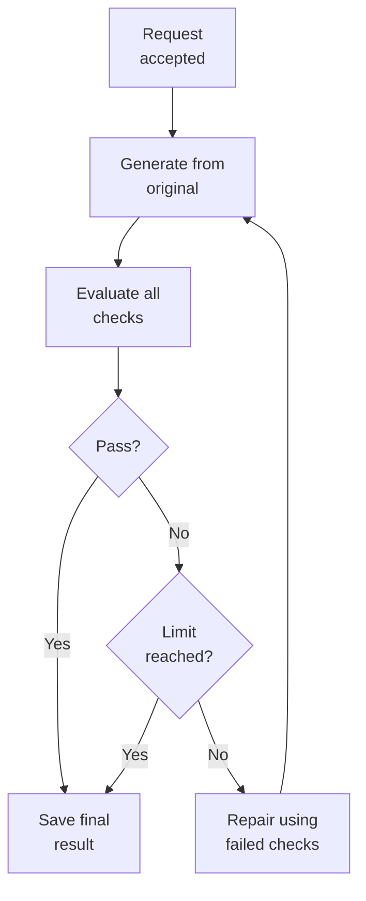

# Design

## What this service does

- Accepts marketing creatives, recommendations, and brand guidelines.
- Generates one edited variant for each creative.
- Evaluates every requested change and brand rule.
- Returns immediately with a task URL; callers poll for the final variants and
  evaluations.

## Flow

## Choices I made

- **Two focused model calls:** one edits; one evaluates. This makes failures
  easier to inspect than a single prompt that both edits and judges itself.
- **No agent framework:** the workflow is a short, explicit feedback loop. A
  planner or tool-calling loop would not improve this assignment.
- **Repair from the original:** each repair receives the latest failed checks,
  but starts with the original creative to avoid accumulated visual changes.
- **One evaluator request per variant:** it compares both images and checks all
  recommendations and brand criteria together, which keeps cost and judgments
  consistent.
- **Small concurrency limit:** two image pipelines may run at once; each one is
  sequential internally because generation and evaluation depend on each other.
- **Structured results:** evaluator output must match the requested IDs and
  criteria. The application calculates `overall_pass` from those individual
  checks instead of trusting a model summary.

## Guardrails

- The API validates image format, upload size, JSON shape, and filename matches.
- Generated images are decoded before being saved or served.
- Task and image IDs are server-generated; uploaded filenames never become
  filesystem paths.
- Configuration is validated once at startup. Secrets are separate from normal
  TOML settings.
- The default tests use a deterministic fake service; they are fast,
  credential-free, and do not use the network.
- Errors and logs exclude secrets, image bytes, full prompts, and provider
  payloads.

## What I would add when it is needed

- Durable task state and object storage for restart recovery.
- Authentication and tenant isolation before exposing the service publicly.
- A queue and multiple workers when one process is no longer enough.
- Offline evaluation datasets, agreement metrics, and human review for
  brand-sensitive decisions.

Those are intentionally absent here. This case is meant to show the core
workflow and the decisions needed to evolve it, rather than imitate a complete
production platform.
