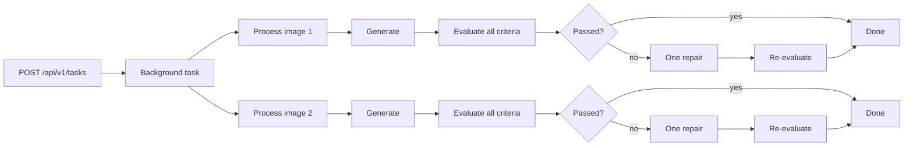

# Visual Recommendations - Minimal Viable Solution Design

## Goal

Build a minimal viable, maintainable, containerised asynchronous FastAPI service
that meets the requirements:

- Accept marketing creatives, textual recommendations, and brand guidelines.
- Generate an edited visual variant for each creative.
- Evaluate whether every recommendation was applied.
- Evaluate whether the variant complies with the brand guidelines.
- Expose the workflow through Swagger UI without building a separate frontend.

The implementation should demonstrate a clear agentic workflow and apply
proportionate software-engineering best practices: explicit ownership, validated
boundaries and configuration, dependency injection at external seams, and
deterministic tests. These practices must not introduce production infrastructure
or speculative abstraction that the assignment does not require.

## Core design

The application has two AI roles implemented as ordinary Python functions behind
one small OpenAI adapter:

1. **Image editor** - creates one variant from the original creative, all of its
   recommendations, and its brand guidelines.
2. **Visual evaluator** - compares the original and generated images and returns
   a structured decision for every recommendation and brand criterion.

If the first variant fails evaluation, the editor may make exactly one repair
attempt using the evaluator's feedback. This bounded feedback loop is the
agentic part of the workflow. It does not require an agent framework, planner,
tool-calling loop, or general-purpose state machine.

## Engineering baseline

The MVP keeps a few conventional quality boundaries because they make the code
easier to review and change without expanding the product scope:

- `create_app` is the composition root. It constructs application-owned state
  and accepts configuration and the OpenAI adapter as dependencies, which keeps
  tests isolated without a dependency-injection framework.
- The `config` package is the only place that reads the selected TOML document,
  the local secret file, or environment variables. Settings are typed,
  validated once at startup, and then passed explicitly.
- Dependencies point inward: FastAPI handlers call the workflow, the workflow
  uses validated models and the narrow image-service contract, and provider
  request details stay in the OpenAI adapter. The workflow does not import or
  return FastAPI types.
- Long-lived provider clients are created once per application and closed by
  the FastAPI lifespan. A client is not constructed for every model call.
- `pyproject.toml` is the single home for dependency and tool configuration;
  `uv.lock` is committed for reproducible installs.
- Formatting, linting, static type checking, and deterministic tests form the
  automated quality gate.

Packages make the main concerns visible when skimming the repository: API
routing, configuration, schema-backed models, workflow orchestration, and AI
service adapters. Each package keeps a small public interface and avoids
additional internal layers until its responsibilities provide a concrete reason
to split further.

## API

FastAPI exposes the interactive Swagger UI at `/docs` and its generated OpenAPI
schema at `/openapi.json`. Swagger UI is the demo interface for submitting the
multipart request and inspecting the polling endpoints.

All task endpoints are versioned under `/api/v1`. The operational health check
is deliberately unversioned because it reports whether this service process is
running rather than exposing a product API contract.

### `POST /api/v1/tasks`

Starts an asynchronous visual-recommendation task.

The request uses `multipart/form-data` so it can be submitted directly through
Swagger UI.

| Field | Type | Description |
| --- | --- | --- |
| `images` | One or two PNG/JPEG files | The supplied marketing creatives. |
| `recommendations` | JSON file | Recommendations grouped by image filename. |
| `brand_guidelines` | JSON file | Brand guidelines grouped by image filename. |

The JSON structures match the supplied assignment files. Filenames join each
uploaded image to its recommendations and guidelines.

Successful response: `202 Accepted`

```json
{
  "task_id": "3e866993-5c55-4db5-a2f9-542c442018e9",
  "status": "pending",
  "status_url": "/api/v1/tasks/3e866993-5c55-4db5-a2f9-542c442018e9"
}
```

### `GET /api/v1/tasks/{task_id}`

Returns the current task state. The possible states are `pending`, `running`,
`completed`, and `failed`.

A completed response contains one result per input image:

```json
{
  "task_id": "3e866993-5c55-4db5-a2f9-542c442018e9",
  "status": "completed",
  "results": [
    {
      "image_id": "image_1",
      "source_filename": "creative_1.png",
      "variant_url": "/api/v1/tasks/3e866993-5c55-4db5-a2f9-542c442018e9/variants/image_1",
      "attempts": 1,
      "evaluation": {
        "recommendations": [
          {
            "id": "rec_1",
            "applied": true,
            "reason": "The headline has stronger contrast."
          }
        ],
        "brand_checks": [
          {
            "criterion": "Do not modify or remove the brand logo",
            "compliant": true,
            "reason": "The logo remains visible in its original position."
          }
        ],
        "overall_pass": true
      }
    }
  ],
  "error": null
}
```

### `GET /api/v1/tasks/{task_id}/variants/{image_id}`

Returns the generated image file. `image_id` is a server-owned identifier and is
resolved only within the corresponding task directory.

### `GET /health`

Returns `{"status": "ok"}` when the process is running.

## Asynchronous execution and parallelism

The HTTP request must not wait for image generation. `POST /api/v1/tasks`
records an in-memory task, schedules the workflow as a FastAPI background task,
and returns immediately. The client polls `GET /api/v1/tasks/{task_id}`.

The two image pipelines are independent and run concurrently. Work within one
image pipeline stays sequential because each step depends on the preceding
output.



The workflow uses `asyncio.gather` with at most two concurrent image pipelines.
This is deliberately bounded because image generation is the slowest and most
rate-limit-sensitive operation.

Recommendation checks are not parallelised into separate model calls. The
evaluator receives the original image, generated image, complete recommendation
list, and complete brand-guideline object in one request. It returns one
structured result containing all checks. This choice:

- Reduces API calls, latency, and cost.
- Gives every check the same visual and brand context.
- Avoids conflicting judgments from separate evaluator calls.
- Keeps the evaluation schema and error handling small.

For the supplied two-image, three-recommendation example, a successful task uses
two image-editing calls and two evaluation calls. A failed first attempt adds at
most one image-editing and one evaluation call for that image.

## Workflow

For each image:

1. Load the original image, its recommendations, and its brand guidelines.
2. Build a direct editing prompt that makes the brand guidelines authoritative.
3. Ask the image model to edit the original creative and save the returned
   image under the task directory.
4. Ask the evaluator to compare the original and variant.
5. Validate the evaluator's structured response with Pydantic.
6. If `overall_pass` is false, make one repair from the original image using the
   failed checks as additional instructions, then evaluate once more.
7. Store the final result in the in-memory task record.

Every initial generation and repair starts from the original image. This avoids
cumulative visual drift.

## Data models

Only models used at an external or AI boundary are defined.

```text
Recommendation
  id: str
  title: str
  description: str
  type: str

BrandGuidelines
  protected_regions: list[str]
  typography: str
  aspect_ratio: str
  brand_elements: str

RecommendationCheck
  id: str
  applied: bool
  reason: str

BrandCheck
  criterion: str
  compliant: bool
  reason: str

Evaluation
  recommendations: list[RecommendationCheck]
  brand_checks: list[BrandCheck]
  overall_pass: bool
```

The evaluator must return one `RecommendationCheck` for every supplied
recommendation and one `BrandCheck` for every explicit brand criterion.
Application control flow never depends on unvalidated model prose.

## OpenAI integration

One `OpenAIService` owns both provider calls:

- Image editing uses the OpenAI image-editing API with a configurable image
  model.
- Evaluation uses the Responses API with a vision-capable model and a strict
  JSON Schema response matching `Evaluation`.

The application uses the asynchronous OpenAI client so the two image pipelines
can overlap network waits. Tests inject a deterministic fake service and never
make real API calls.

Non-secret runtime configuration uses one complete TOML document per deployed
environment. The repository includes `config/dev.toml` and `config/test.toml`;
the application loads exactly the path supplied through `APP_CONFIG_FILE` and
does not merge files or branch on an environment name:

```toml
[providers]
image_editor_model = "gpt-image-2"
evaluator_model = "gpt-5.6"
timeout_seconds = 120

[limits]
max_image_size_mb = 10

[logging]
level = "INFO"

[storage]
artifact_root = "runtime/tasks"
```

The only secret setting is `OPENAI_API_KEY`. `.env.example` documents that name
with a safe placeholder, while the real value belongs in the ignored local
`.env` file or the process/container environment. A process environment value
takes precedence over `.env`. `APP_CONFIG_FILE` is required from the shell or
deployment platform and selects one complete non-secret configuration file. It
is not read from `.env`, which remains secret-only. Other non-secret environment
values are ignored so individual settings still have one clear source.

The configuration package contains only the loader and the immutable, typed
`AppConfig` schema and checker; it defines no runtime values. The selected TOML
document is the single source of non-secret setting values. Loading fails fast
with a concise error when no file is selected, or when the selected file is
missing, malformed, incomplete, or contains unknown settings.
Tests can construct `AppConfig` directly or pass explicit file paths without
mutating process-wide environment state.

Only values that are genuinely adjustable are exposed. The two-image limit,
two-pipeline concurrency bound, and single repair attempt remain workflow
invariants rather than environment-specific configuration.

## Storage and task state

Task state is a process-local dictionary keyed by a UUID. Input and generated
images are stored under:

```text
runtime/tasks/<task_id>/
  inputs/
  variants/
```

All directory and file names are generated or resolved by the server. Uploaded
filenames are metadata and are never used directly as filesystem paths.

This MVP runs as one application process. The consequences of process-local
state and storage are recorded explicitly under **Accepted limitations** rather
than addressed with infrastructure outside the assignment scope.

## Validation and errors

Validation is intentionally limited to inexpensive system-boundary checks:

- Accept one or two images.
- Limit upload size.
- Decode each image and accept only PNG or JPEG.
- Parse both JSON files with Pydantic.
- Require recommendations and guidelines for every uploaded filename.
- Reject filenames in the JSON that do not correspond to an uploaded image.

FastAPI/Pydantic validation errors return `422`. An OpenAI or unexpected
workflow exception marks the task as `failed` with a short safe message. The
service does not add retries, exception taxonomies, or partial-success rules.

## Logging

Use Python's standard `logging` module and write to stdout. Log only safe,
operational metadata:

- Task ID and image identifier (`all` for task-wide events).
- Workflow step, attempt number, and task image count where relevant.
- Started, succeeded, or failed outcome.
- Step, pipeline, and task duration.
- Final evaluation pass/fail and exception class names, without exception text.

Do not log API keys, image bytes, filenames, complete prompts, uploaded JSON
payloads, provider payloads, exception messages, or tracebacks.

## Code structure

```text
src/app/
  api/
    __init__.py       Public router exports
    routes.py         Unversioned operational routes
    v1/
      __init__.py     Public v1 router export
      routes.py       Versioned task endpoints and request validation
  config/
    __init__.py       Public configuration exports
    load_config.py    TOML selection plus secret loading
    validate_config.py Typed settings schema and safe validation
  schema_models/
    __init__.py       Public schema-model exports
    models.py         HTTP, upload, workflow-state, and AI-boundary models
  workflows/
    __init__.py       Public workflow exports
    visual_recommendations.py Two-image orchestration and single repair loop
  ai_services/
    __init__.py       Public AI-service exports
    openai.py          OpenAI image-editing and evaluation adapter
  main.py             Composition root and in-memory task registry
tests/
  test_api.py
  test_workflow.py
config/
  dev.toml           Complete non-secret dev settings
  test.toml          Complete non-secret test-deployment settings
Dockerfile
pyproject.toml
README.md
DESIGN.md
.github/workflows/ci.yml
```

These small application concerns are enough. Additional repositories, domain
layers, dependency-injection frameworks, and generalized provider abstractions
are excluded. Package `__init__.py` files expose only the models, workflows,
adapters, routers, or settings used by callers; callers do not depend on
internal file layout.

## Tests

The default test suite uses a fake OpenAI service and covers:

1. A valid upload returns `202` and later completes with two image results.
2. The two image pipelines can be in flight concurrently.
3. One evaluator call receives all recommendations for its image.
4. A failed evaluation triggers no more than one repair.
5. Invalid JSON or an invalid image is rejected.
6. A provider exception marks the task as failed without exposing secrets.

One optional, explicitly enabled smoke test may call the real OpenAI API with a
single supplied creative.

Ruff provides formatting and linting, mypy checks the typed application code,
and pytest verifies behavior. These tools are configured in `pyproject.toml` and
run in one small CI workflow. The real-API smoke test is excluded from CI.

## Container

The Dockerfile uses a small pinned Python base image, installs from the lockfile,
copies only required application files, creates a writable runtime directory,
and runs as a non-root user. It starts one Uvicorn worker because task state is
stored in memory. `.dockerignore` keeps local environments, caches, runtime
artifacts, and secrets out of the build context.

Docker Compose, Redis, PostgreSQL, a separate worker container, and cloud object
storage are not required.

## Explicit non-goals

- A custom frontend.
- Durable jobs or restart recovery.
- Authentication, users, or multi-tenancy.
- A distributed task queue.
- A planning agent.
- More than one generated variant per creative, except the bounded repair.
- Parallel evaluator calls per recommendation.
- Automatic provider retries or exponential backoff.
- Pixel-perfect proof that logos, faces, products, or typography are unchanged.
- Production deployment infrastructure, metrics, or tracing.

## Accepted limitations

These are deliberate tradeoffs for the interview MVP and should be stated in
the README and technical discussion:

- Task state is process-local. A restart loses task status and interrupts
  pending or running work; tasks are not resumed.
- The service runs one process with one worker. It does not support horizontal
  scaling or coordinate work across instances.
- Inputs and variants use local disk. Artifacts are not durable, and task
  directories are not removed automatically.
- A technical failure in either image pipeline fails the whole task. There is
  no partial-success response or automatic provider retry.
- Image generation and visual evaluation are probabilistic. A passing brand
  evaluation is a model judgment, not pixel-perfect proof of compliance.
- Each request is limited to two creatives, one initial variant per creative,
  and at most one repair; the service does not search for the best of several
  candidates.
- There is no authentication or tenant isolation, so this service is intended
  for a controlled demo environment rather than public deployment.
- Swagger UI is the only user interface, and clients must poll for completion.

## Acceptance criteria

The MVP is complete when:

- It builds and runs in Docker.
- Swagger UI accepts the two supplied creatives and two supplied JSON files.
- Submission returns `202` without waiting for model work.
- Both image pipelines run concurrently.
- Each creative produces a retrievable variant and structured evaluation.
- Every recommendation and brand criterion appears in the evaluation result.
- At most one repair is attempted per image.
- Automated tests pass without network access or an API key.
- Formatting, linting, and static type checks pass locally and in CI.
- The container runs as a non-root user with dependencies installed from the
  committed lockfile.
